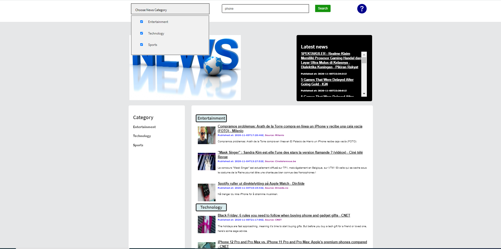
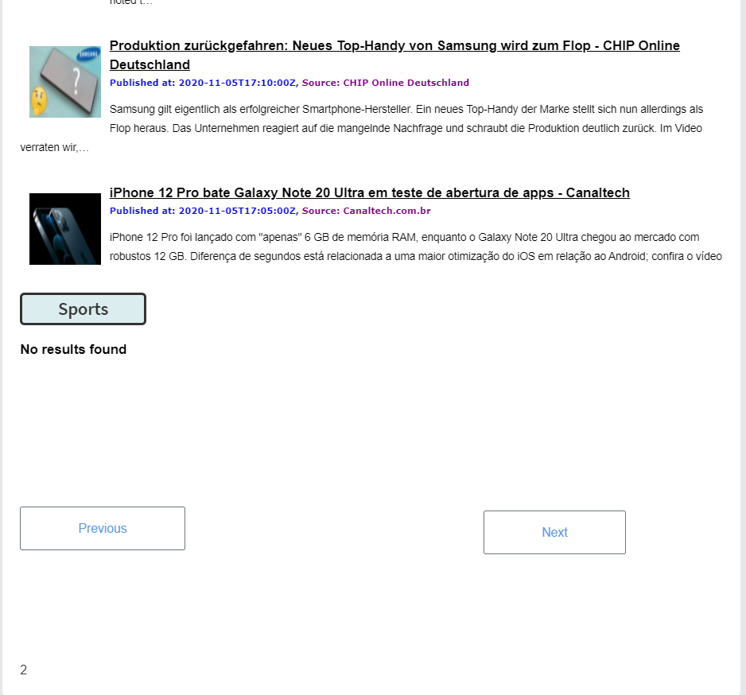
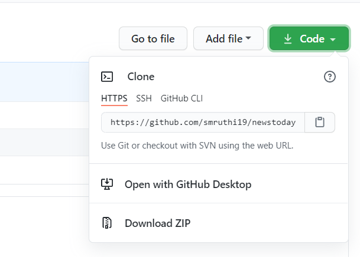
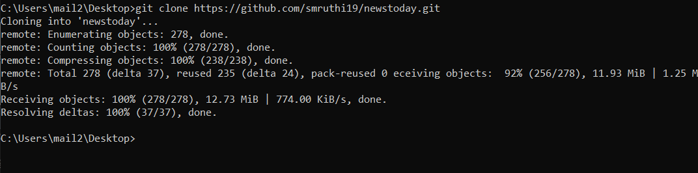
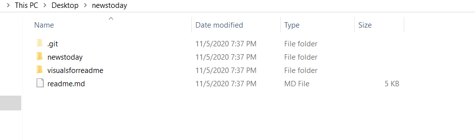
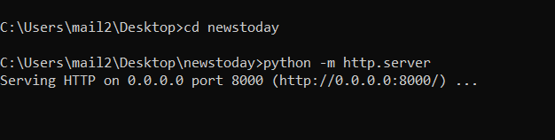
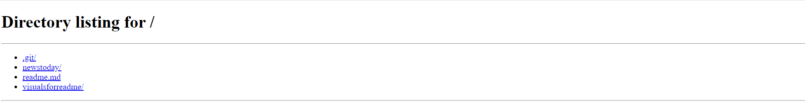

# Newstoday

## Description ##
A web application using News API that allows users to search for news in the three categories of entertainment, sports, and technology and displays matching news results filtered by the categories selected. The results include the news headline, link, source, date, corresponding image, and article description. 

# Features
- Search news by keyword 
- Search news by keyword and by selected categories (Entertainment, Technology, Sports)
- Matched filtered news results by category based on search keyword
- Article headline, link, image, source, date published, and description for each search result
- Latest top headlines for news in entertainment, technology, sports
- Help icon for accessing FAQ

# Development Process
To develop this web application, I used HTML, CSS, and JavaScript and implemented the Bootstrap framework. I started with implementing the NewsAPI, specifically integrating the user's search keyword input and category selections to set according parameters in the API and parse through the data. I then worked on displaying the news data, including the title, article link, date published, image, source, and description for each corresponding search result. If the user did not select any categories, the default would be to display pertaining search results to the keyword from all the three categories. If the API does not have certain images, or there is an error, a default image indicating that the image is not available is displayed. Likewise, if the date pusblished, source, or description is missing, a message indicating this is displayed. Following this, I used CSS and HTML for developing the styling and design of the website. 

# How the website works
On load of the home page, the latest five top headlines from each category is displayed. There is also an option to sort these top five headlines by category by selecting the corresponding links from the left panel on the home page. The home page also includes a scroll menu to display the latest headlines, including the article links, from each category on load of the website. 

The user has the option to also search for any keyword in the search bar at the top and can select one or more categories to filter the search by. The corresponding articles, with their titles, links, descriptions, dates published, images, and sources are displayed by category. If there is more than one page of results, the next page button will allow the user to continue to view more articles related to their search. There is also a previous page button to go back if there are multiple pages.

The web application also includes an about page, and a help icon feature, which links to an FAQ page. 

# Visuals
Search Feature

   

Search Example

   

Multiple Pages buttons

# Technologies
- Bootstrap
- JavaScript
- HTML
- CSS

# Setup
To run this code locally, please select the dropdown arrow from the green button "code" at the upper right hand corner of the main page of the repository. 

From the dropdown, copy the HTTPS link. Then, open Command Prompt or the terminal that you prefer to use and "cd" into the directory where you would like to store the repository. 
Then, enter git clone <repo-url> (paste the copied link in the placeholder, without the triangle brackets). Wait until all of the objects have been received and the processing finishes. 

 
 
Then, navigate to your selected directory to check if the repository is there. 
 
 

 
 
Next, cd into this repository folder that you just stored and cd into the newstoday subfolder inside of the repository. (See picture below)

Next, type the command: python -m http.server

Then, you should see the following message. (See picture below).

Next, go to http://localhost:8000/.

You should see the directory listing as shown below. Select newstoday/.

You should then see the website.

# Other notes
- Any missing article content from the API such as source, date, image, etc. have default values (ex: "No description available", "No publish date available,", "No source available", default image).
- User can select one category or multiple categories for searching a keyword.
- If there are no matching search results in the respective categories that the user selected, then the message "No results found" is accordingly displayed in those categories.
- If the user does not select a category while searching for their keyword, any pertaining results from all three categories are filtered and accordingly displayed.

